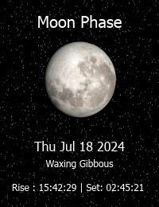

# Moon-Phase-App

A "simple" app to request a specific moon phase by date and other parameters to show how it looks



Beware onclose of the app it deletes the folder with the images in it!

> Warning: This is not close to finished!

## Get-Started

First off get yourself a API key for free at: [Astronomy API](https://docs.astronomyapi.com/)

When you get your `APP_ID` and `APP_SECRET`, make a `.env` file that looks like this:

```properties
# add app id
APP_ID=key
# and add the app secret
APP_SECRET=key
```

```PowerShell
# Create the venv in the folder of choice
python -m venv .venv
# Install the needed librarys
python -m pip install -r requirements.txt
# run the app (by defualt)
py .\main.py
# or
# run the server app (Not even started, but hopefully soon!)
py .\main.py server
```

Warning: Html files are not included, YET!

### Design

The layout of this project is a Figma file:
[Moon Phase App Layout](https://www.figma.com/design/45IkxmpJ02QLcfx7dg3Ve6/Moon-Phase-App?node-id=0-1&t=NAOEOGGjnye4eSVL-1)

Deprecated Items can be accessed by presing **F1**

Versions:

- App ver: 2.0.1
- GUI ver: 3.1.0
- Moon Phase Requester ver: 2.0.2
- Constants ver: 1.0.1
